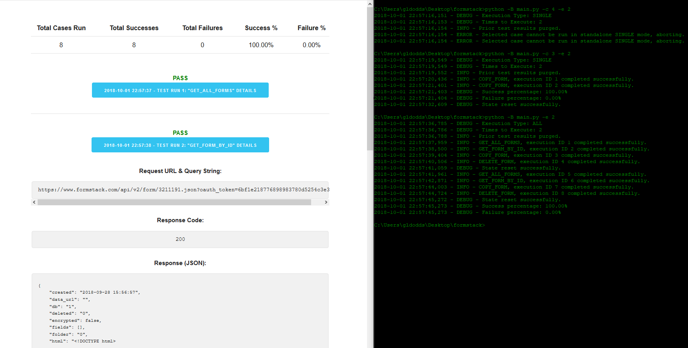

# formstack-challenge



My Formstack challenge automation solution: a small, easily-expandable utility for running a set of test cases in various combinations (with a user-friendly HTML auto-generated results page.)

# Requirements
* `pip install pygogo`
* `pip install bs4`
* `pip install simplejson`

# How It Works

This tool has two different execution modes: `ALL` and `SINGLE`. By default, the script executes as `ALL` and iterates through all of the test cases found in the `testcases` folder. If the `main.py` script is called with the `-e` flag (shorthand for times to execute), it will loop through all test cases for however many rounds are specified. If the script is called with the `-c` flag (shorthand for case), it will switch over to `SINGLE` execution mode and run just the case number specified from the suite. If both flags are combined, the user can specify a specific test case to be executed X number of times.

Debug, info, & error output is piped out to the console. Once execution is complete, formatted results are also exported to the `results.html` file located within the `results` folder. This export contains a table with various run statistics, as well as collapsible bars containing additional info for each test case executed.

To adapt to your own account / environment, modify the `config.py` file to use your own OAuth token and update which form of your should act as the default when a form ID is specified within the test cases. (Within the test cases themselves, you will also have to update the FormData IDs, Names, & URLs specified at the top of each.)

# Sample Input
```
python -B main.py -e 2
```

# Sample Console Output
```
2018-10-01 22:57:36,785 - DEBUG - Execution Type: ALL
2018-10-01 22:57:36,786 - DEBUG - Times to Execute: 2
2018-10-01 22:57:36,788 - INFO - Prior test results purged.
2018-10-01 22:57:37,959 - INFO - GET_ALL_FORMS, execution ID 1 completed successfully.
2018-10-01 22:57:38,500 - INFO - GET_FORM_BY_ID, execution ID 2 completed successfully.
2018-10-01 22:57:39,404 - INFO - COPY_FORM, execution ID 3 completed successfully.
2018-10-01 22:57:40,506 - INFO - DELETE_FORM, execution ID 4 completed successfully.
2018-10-01 22:57:41,059 - DEBUG - State reset successfully.
2018-10-01 22:57:41,961 - INFO - GET_ALL_FORMS, execution ID 5 completed successfully.
2018-10-01 22:57:42,871 - INFO - GET_FORM_BY_ID, execution ID 6 completed successfully.
2018-10-01 22:57:44,003 - INFO - COPY_FORM, execution ID 7 completed successfully.
2018-10-01 22:57:44,724 - INFO - DELETE_FORM, execution ID 8 completed successfully.
2018-10-01 22:57:45,272 - DEBUG - State reset successfully.
2018-10-01 22:57:45,273 - DEBUG - Success percentage: 100.00%
2018-10-01 22:57:45,273 - DEBUG - Failure percentage: 0.00%
```
